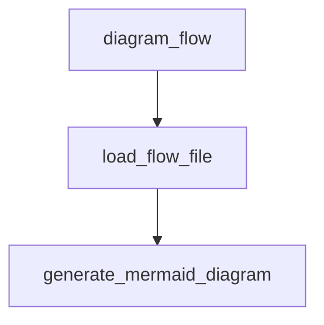

# Docuflows

**Docuflows** is an open‑source developer‑experience tool that instantly maps your codebase into shareable "flows."  With a single command you can:

* 🔍 **Visualize** every function involved in a feature, without adding annotations.
* 💬 **Diagram** SVG/Markdown diagrams in pull‑requests so reviewers see the impact of each change.

---

## ✨ Features

| CLI (Core OSS)                                       |
| ---------------------------------------------------  |
| `docuflows parse` — generate call‑flow graphs        |
| `docuflows diagram` — export into Mermaid.js format  |

---

## 🚀 Quick Start

### 1 · Install

```bash
# Requires Rust 1.78+
cargo install docuflows
```

### 2 · Generate a flow

```bash
cd /path/to/your/project
# Analyze the whole repo and output a checkout.flow file

docuflows parse ./src
```

### 3 · Preview the diagram

```bash
docuflows diagram my_flow
```

### Example



---

## 🗂 Folder Structure

```
my‑app/
├── src/
│   └── …
└── .docuflows/
    ├── checkout.docuflow
    └── user‑registration.docuflow
```

Each `.docuflow` file is an **ordered list of fully‑qualified function signatures**, stored right next to your code so the whole team can iterate via normal Git workflows.

---

## 🌐 Language Support

| Language        | Status     |
| --------------- | ---------- |
| Rust            | ✅ stable   |
| Swift           | 🚧 planned   |
| JavaScript / TS | 🚧 planned   |
| Python          | 🚧 planned   |
| Kotlin          | 🚧 planned |
| Go              | 🚧 planned |

---

## 🛠 CLI Reference

Run `docuflows --help` for the full command list.

```
Visualize feature flows in codebases with Docuflows

Usage: docuflows [COMMAND]

Commands:
  diagram, -d, --diagram  Generate a Mermaid.js diagram from a .docuflow file
  parse, -p, --parse      Parse source directory and list all function names
  help                    Print this message or the help of the given subcommand(s)

Options:
  -h, --help     Print help
  -V, --version  Print version
```

> Built with ❤️ & 🦀 by [Docuflows](https://twitter.com/docuflowsio).
